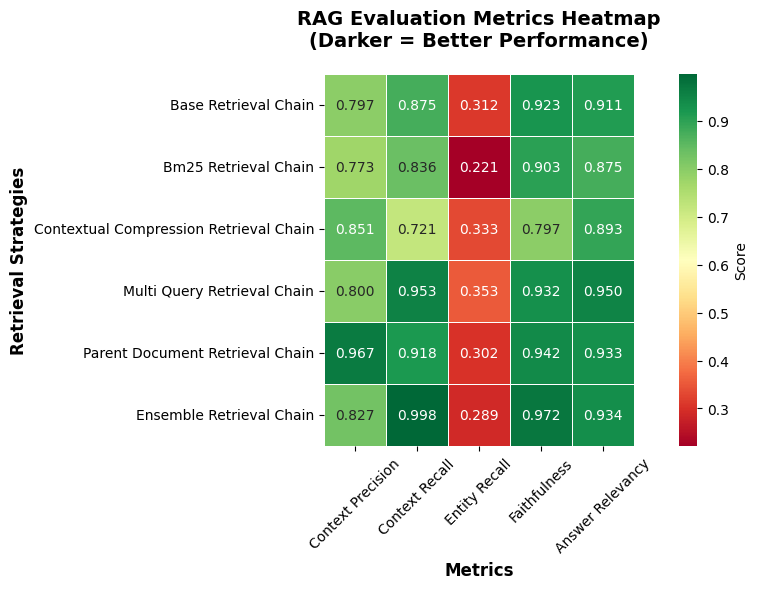

# CERTIFICATION CHALLENGE TASKS
---

# ParentALL - A Positive Discipline Parenting Companion App

# Task 1: Articulate the problem and the user of your application  

1. One sentence description of the problem (candiates):
2. Write 1-2 paragraphs on why this is a problem for your specific user

**✅ SOLUTION**

(1) One sentence description:

Parents sometimes feel lost\guilty\stuck as to how to handle\manage challenging situations with their kids:
- Lost: literally they do not know what to do or who to turn to discuss particularly hard challenges
- Guilty: parent managed the situation, but they are not happy about what they did and feel guilt (too harsh, too permisive, and everything in between)
- Stuck: parent is doing what he\she learned as child, but do not like what he\she is doing - needs a bettwer way that speaks true to them.

(2) Problem for your specific user:

Parents will always encounter challenging situations with their kids. Kids are hardwired to test boundaries (and that’s a good thing); it’s one of the ways they discover the world and their place in it. Today’s parents were once kids themselves, and what they saw from their own parents is, in most cases, their main reference point for how to "parent." The problem is that, in multiple instances, many of today’s parents do not agree with or like what they experienced as children. They want to do things differently, but they may not be sure how to act on that desire, even if they clearly realize they want change. Worse, they may not have anyone in their close circle to talk about it with in a way that provides psicological safety. It is not easy to admit for anyone when you feel lost, guilty or stuck.

---

# Task 2: Articulate your proposed solution

1. Write 1-2 paragraphs on your proposed solution.  How will it look and feel to the user?
2. Describe the tools you plan to use in each part of your stack.  Write one sentence on why you made each tooling choice.  
3. Where will you use an agent or agents?  
4. What will you use “agentic reasoning” for in your app?  

**✅ SOLUTION**

(1) Write 1-2 paragraphs on your proposed solution.  How will it look and feel to the user?

To address these challenges, we introduce ParentALLm, a Positive Discipline Parenting Companion chat application. This companion allows parents to debrief their worries and challenges, seeking advice on how to navigate all kinds of situations, from the deeply frustrating (tears) to the joyful and anecdotal. Parents will intract with the app via a chat UI, were multi turn chatting will take place as well as other type of inputs, such as moods at the begining and end of all interactions. The companion will not only supports parents by remembering and managing every interaction and piece of advice focused on their children, but also provides tools to promote self-care and self-acceptance for the parent. Let's remember "Peceful parents - Happy Kids".

(2) Describe the tools you plan to use in each part of your stack.  Write one sentence on why you made each tooling choice.

- LLM --> OpenAI 4.1 mini: balance between performance, speed, and cost-effectiveness
- Embedding Model --> OpenAI's text-embedding-3-small is a lightweight, high-performance, perfect balance for the job
- Orchestration --> LangGraph - we have learned what the tool can do and it is a suitable option
- Vector Database --> Qdrant - we have learned what the tool can do and it is a suitable option
- Monitoring --> LangSmith - top notch tracing enabled by simply adding decorators
- Evaluation --> RAGAS, simple to setup and delivers killer value 
- User Interface --> React frontend is the top choice here considering the beautiful UIs that can be generated and that GenAI tools like Cursor can create those in minutes
- (Optional) Serving & Inference --> FastAPI (local host) due to it is simplicity while being super effective

(3) Where will you use an agent or agents?  

The agent will manage the multi turn chating app, as well as all the context data needed for that: long term memory, short term memory, RAG tool, and web search tools.

(4) What will you use “agentic reasoning” for in your app?

The app will use the ReAct framework to determine which tools to use for retrieving meaningful information in response to user queries.

---
# Task 3: Collect data for (at least) RAG and choose (at least) one external API

**✅ Deliverables**

1. Describe all of your data sources and external APIs, and describe what you’ll use them for.
2. Describe the default chunking strategy that you will use.  Why did you make this decision?
3. [Optional] Will you need specific data for any other part of your application?   If so, explain.

**✅ SOLUTION**

(1) Sources:  

- RAG: Positive discipline blog post
- Tools: tavily to perform relevant web searches 

(2) I experimented with:  

    (a) Naive chunking retrieval  
    (b) Contextual compression retrieval  
    (c) BM25 retrieval  
    (d) Multi-query retrieval  
    (e) Parent-child retrieval  
    (f) Ensemble

The goal is to have an apples-to-apples comparison and get a sense of which method performs better with the dataset at hand.

(3) [Optional] Will you need specific data for any other part of your application?  If so, explain.

Not really.

---
# Task 4: Build an end-to-end Agentic RAG application using a production-grade stack and your choice of commercial off-the-shelf model(s)

**✅ SOLUTION**

The end-to-end solution can be found in this repo. The stack includes LangGraph for orchestration, LangSmith for tracing, Qdrant for the vector databases, React for the frontend, and FastAPI for the backend.

---
# Task 5: Generate a synthetic test data set to baseline an initial evaluation with RAGAS

**✅ Deliverables**

1. Assess your pipeline using the RAGAS framework including key metrics faithfulness, response relevance, context precision, and context recall.  Provide a table of your output results.
2. What conclusions can you draw about the performance and effectiveness of your pipeline with this information?

**✅ SOLUTION**

(1) The raw dataset for this app, comprised of Positive Discipline blogs, can be found under ./data/pd_blogs_filtered. For this challenge, I selected a subset of 84 blogs to work with. Using the available data, I constructed a golden dataset. This dataset was generated using the file:

proto_loaddata_retrievals_evals.ipynb

In that same file, I performed an initial evaluation using multiple retrievers. The resulting metrics can be found in the picture here:

images/intial_eval/intial_evals.png

Note: These results only considered the RAG portion of the app and did not include the full pipeline, which I implemented later.

(2)  Based on the initial information in the table, we can see that the parent-child retrieval method is effective, achieving over 90% in both context precision and context recall, demonstrating effectiveness of our RAG tool. While entity recall is quite low across all retrieval methods, this metric is known to be somewhat stringent. Overall, the preliminary data shows that our RAG tool is plausible, with over 90% faithfulness and answer relevancy, and is effectively performing its intended task.  

---
# Task 6: Install an advanced retriever of your choosing in our Agentic RAG application. 

**✅ Deliverables**

1. Describe the retrieval techniques that you plan to try and to assess in your application.  Write one sentence on why you believe each technique will be useful for your use case.
2. Test a host of advanced retrieval techniques on your application.

**✅ SOLUTION**

(1) Based on the results from task 5, I selected two methods to run a full pipeline evaluation of the RAG system: naive and parent-child retrievers. The selection was driven by the evaluation metrics, but also by practical considerations—both methods are effective and well-suited for the type of data being used.
The naive method is attractive due to its simplicity and strong performance, while the parent-child approach works well for relatively short blog documents like those in our dataset.

- Results for naive retriever (chunk size:750, overlap: 0): proto_agent_eval_baseline_naive_retrieval.ipynb

- Results for improved naive retriever (chunk size:1000, overlap: 200): proto_agent_eval_baseline_naive_retrieval.ipynb (same file, updated logic)

- Results for parent-child retriever (chunk size:750, overlap: 0): proto_agent_eval_advance_retrieval.ipynb

- Results for improved parent-child retriever (chunk size:1000, overlap: 200): proto_agent_eval_advance_retrieval_improved_test2.ipynb

(2) Summary table of tested techniques:  

### Evaluation Results Summary

| Metric                              | Naive (Mean ± Std)        | Naive Improved (Mean ± Std) | Parent-Child (Mean ± Std)     | Parent-Child Improved (Mean ± Std) |
|-------------------------------------|----------------------------|------------------------------|--------------------------------|-------------------------------------|
| LLM Context Precision               | 1.000 ± 0.000              | 1.000 ± 0.000                | 1.000 ± 0.000                  | 1.000 ± 0.000                       |
| Context Recall                      | 0.704 ± 0.247              | 0.748 ± 0.268                | 0.887 ± 0.193                  | 0.904 ± 0.167                       |
| Context Entity Recall               | 0.268 ± 0.328              | 0.293 ± 0.344                | 0.280 ± 0.346                  | 0.280 ± 0.355                       |
| Faithfulness                        | 0.672 ± 0.232              | 0.749 ± 0.218                | 0.910 ± 0.133                  | 0.903 ± 0.135                       |
| Answer Relevancy                    | 0.916 ± 0.188              | 0.953 ± 0.025                | 0.953 ± 0.027                  | 0.951 ± 0.028                       |

Based on the table we can see that parent\child retrieval methods perform better than Naive ones.
The advance and advance improved are quite similar, but I am favoring and selecting the improved based on the slightly higher recall. Other metrics are just within the noise. The selection of the advanced retrieval method (based on the parent-child retriever) was confirmed by the results from:

proto_agent_eval_advance_retrieval_improved_test2.ipynb

---
# Task 7: Assess the performance of the naive agentic RAG application versus the applications with advanced retrieval tooling

**✅ Deliverables**

1. How does the performance compare to your original RAG application?  Test the fine-tuned embedding model using the RAGAS frameworks to quantify any improvements.  Provide results in a table.
2. Articulate the changes that you expect to make to your app in the second half of the course. How will you improve your application?

**✅ SOLUTION**

(1) The improved advanced retrieval method was the best-performing option among those evaluated. Refer to the table above for details.

(2) Upcoming potential changes:  

- Move the vector database to a different hosting option (currently hosted locally)

- Increase the number of blogs used from ~80 to approximately 400–500

- Add guardrails

- Add further personalization and a method to gather user feedback regarding the efficiency of the advice

- Add support for multi-user access (this is essential for managing long-term memory)

- Conduct further evaluations

- Improve the user interface

- Improve the API folder and file structure